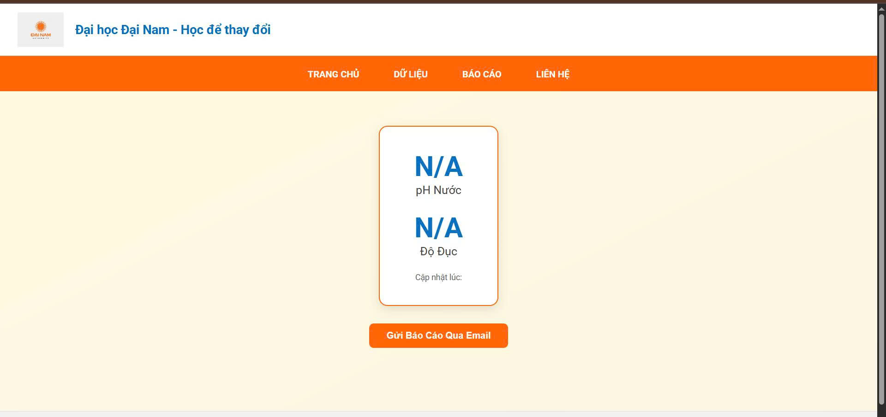

<h2 align="center">
    <a href="https://dainam.edu.vn/vi/khoa-cong-nghe-thong-tin">
        🎓 Khoa Công nghệ Thông tin - Đại học Đại Nam
    </a>
</h2>

<h2 align="center">
    THÀNH PHỐ THÔNG MINH - NÔNG NGHIỆP THÔNG MINH
</h2>

     

  
  
  

---

## 📌 Giới thiệu chung

Dự án này nằm trong học phần **Nông nghiệp thông minh** theo định hướng **Thành phố thông minh (Smart City)**. Hệ thống được thiết kế nhằm **giám sát chất lượng nước** trong **mô hình thủy canh**, tập trung vào **độ pH** và **độ đục (NTU)**. Hệ thống có khả năng gửi thông báo email khi phát hiện thông số vượt ngưỡng, góp phần nâng cao hiệu quả canh tác và tự động hóa trong nông nghiệp.

---

## 🧭 Sơ đồ hệ thống & Chức năng

### 🛠 Chức năng chính:
- **Đọc dữ liệu cảm biến:** Thu thập giá trị pH và độ đục từ hệ thống trồng cây thủy canh.
- **Truyền dữ liệu:** Arduino gửi dữ liệu qua UART sang ESP32.
- **Hiển thị giao diện web:** Flask hiển thị dữ liệu dạng biểu đồ và thông số.
- **Gửi cảnh báo email:** Khi pH hoặc NTU vượt ngưỡng an toàn.
- **Lưu trữ dữ liệu:** Tự động lưu lại dữ liệu theo thời gian thực để thống kê.

### 🖼️ Ảnh giao diện

